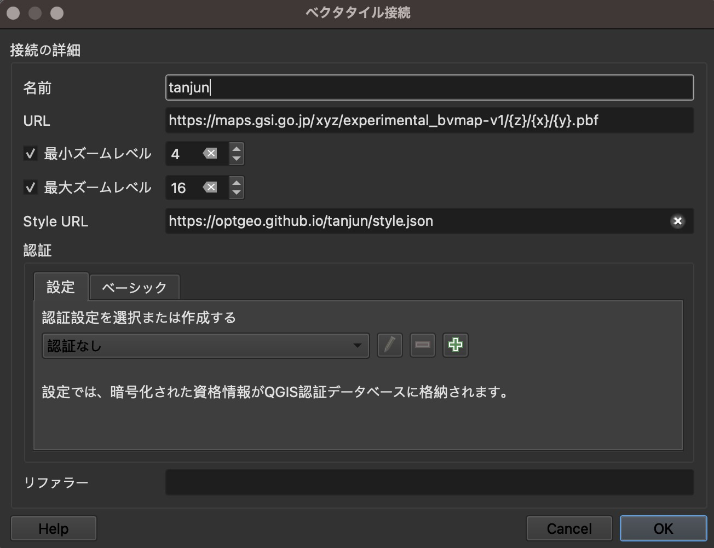

# tanjun
Simplistic style.json for GSI's optbv to be used with QGIS.

## How to use with QGIS

## About the social preview image
The social preview image was taken from [Kimono with Checked Pattern](https://www.metmuseum.org/art/collection/search/65755). 
